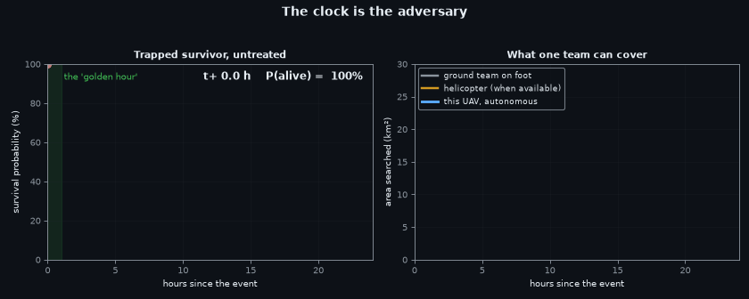
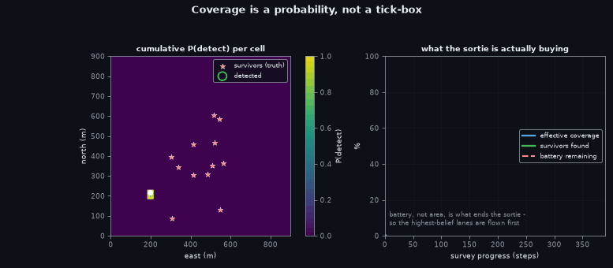
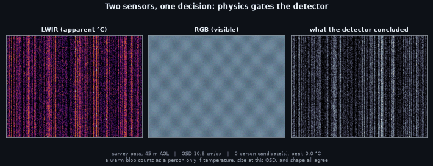
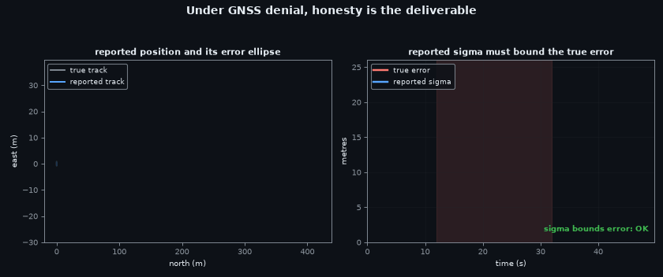
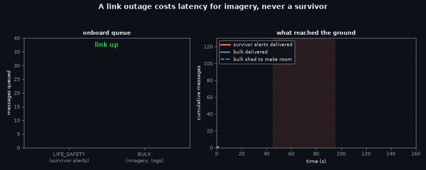
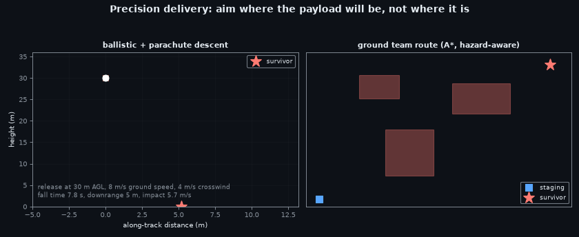
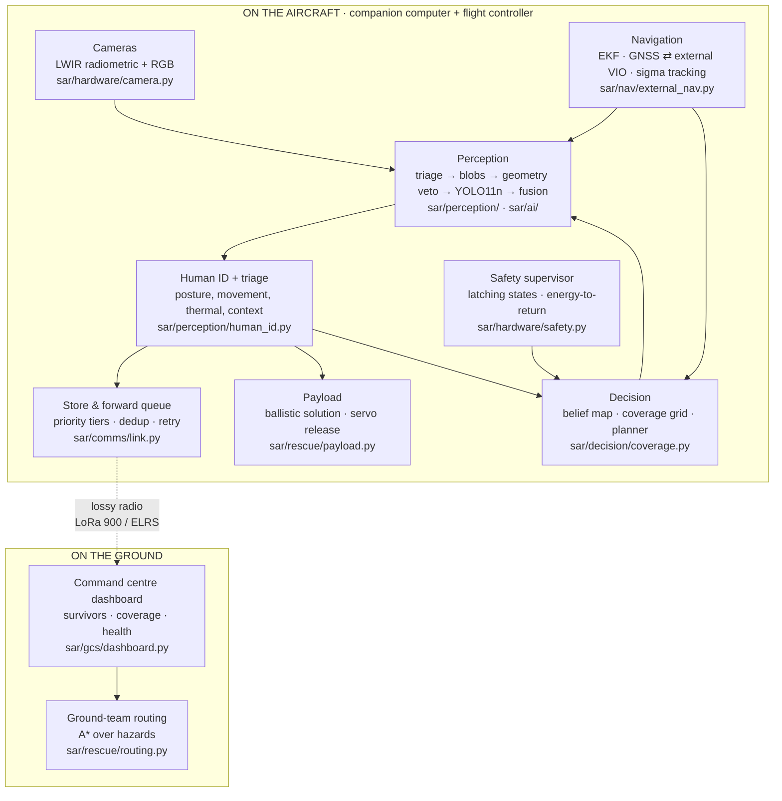

# `teach.md` — How this drone finds people, explained from zero

*Sahyog SAR · SIH Problem Statement 26177 · Qualcomm Inc · Robotics & Drones*

This is the teaching document. It assumes you know nothing about search theory,
thermal imaging, or drones, and it ends with you understanding every design
decision in this repository and being able to point at the code that implements
it.

Every animation below was **generated by running the actual system** —
`python3 scripts/make_teaching_assets.py`. There are no mock-ups. If the code
changes and a figure becomes wrong, regenerating it shows the change.

---

## Contents

| # | Section | The question it answers |
|---|---|---|
| 0 | [The 60-second version](#0-the-60-second-version) | What is this? |
| 1 | [The problem: the golden hour](#1-the-problem-the-golden-hour) | Why does speed decide who lives? |
| 2 | [Why a drone, and why this is hard](#2-why-a-drone-and-why-this-is-hard) | Why not a helicopter or a phone app? |
| 3 | [Search: coverage is a probability](#3-search-coverage-is-a-probability) | How do you search an area properly? |
| 4 | [Seeing: two sensors, one decision](#4-seeing-two-sensors-one-decision) | How does it know that warm blob is a person? |
| 5 | [The AI](#5-the-ai-what-model-and-why) | What model, why that one, and how is it trained? |
| 6 | [Deciding: who needs help first](#6-deciding-who-needs-help-first) | Triage without touching anybody |
| 7 | [Knowing where you are without GPS](#7-knowing-where-you-are-without-gps) | The hardest single problem here |
| 8 | [Telling someone: the radio](#8-telling-someone-the-radio) | A found survivor nobody hears about is not found |
| 9 | [Acting: the payload drop](#9-acting-the-payload-drop-and-the-ground-team) | From a pin on a map to help on the ground |
| 10 | [How it all fits together](#10-how-it-all-fits-together) | The architecture, one diagram |
| 11 | [From simulation to a real aircraft](#11-from-simulation-to-a-real-aircraft) | Is this real, or a demo? |
| 12 | [What is honestly not done](#12-what-is-honestly-not-done-yet) | The limitations, stated plainly |

---

## 0. The 60-second version

> A quadcopter flies a search pattern over a disaster area with a **thermal
> camera** and a **normal camera**. On-board AI finds people, decides how
> urgently each one needs help, works out **where on Earth** they are — even
> when GPS has failed — and radios that to a rescue command centre over a link
> that keeps dropping. If a person is unreachable, it drops them a float, a
> water bottle or a radio beacon, and computes the fastest walking route for the
> ground team.

Four things make it more than "a drone with a camera":

1. **Physics gates the AI.** A detection is only believed if the target's
   apparent temperature, its size in pixels at the current ground resolution,
   and its shape all agree. A neural network alone would report warm rooftops.
2. **Uncertainty is a first-class output.** Every reported survivor comes with a
   position error estimate. A pin with no error bar sends a team to the wrong
   ditch.
3. **It assumes the radio is broken.** Everything is queued, prioritised and
   re-sent; alerts survive at the expense of imagery.
4. **The simulator is radiometric.** It models heat and light in physical units,
   so numbers measured in simulation transfer to real sensors instead of being
   marketing.

---

## 1. The problem: the golden hour

<p align="center">
  
</p>

Survival after a flood, an earthquake or a landslide is a **race against a
falling curve**. Roughly: a trapped or exposed casualty's chance of survival is
near-certain in the first hour and falls steeply afterwards — hypothermia,
crush injury, dehydration, blood loss. The curve does not wait for the search
to be organised.

The animation puts three searchers against that curve:

| Searcher | Search rate | Reality |
|---|---|---|
| Ground team on foot | ~0.02 km²/h in flood debris | Slow, risks the rescuers, cannot cross water |
| Helicopter | ~4 km²/h | Fast, but costs thousands per hour, needs a crew and clear weather, and cannot hover low over every warm object |
| **UAV, thermal + RGB** | **~1.2 km²/h per aircraft, launched in minutes** | Cheap enough to fly several, low enough to resolve a person, no crew at risk |

The lesson the figure teaches: **the drone's advantage is not speed, it is
availability.** It is in the air 20 minutes after the call, while the helicopter
is still being tasked. Area under the survival curve is lives.

---

## 2. Why a drone, and why this is hard

The naive picture is "fly around, run object detection, done". Four things
break that.

**(a) A person is very small from the air.** At 50 m altitude with a 160×120
thermal core, one pixel covers about 12 cm of ground. A person lying down is
maybe 15 pixels of *area* — not a recognisable human shape, a warm smudge.
Fly higher to cover more ground and they disappear into a single pixel.

```
   altitude   ground sample distance   person (1.7 x 0.4 m) occupies
    22 m           5.2 cm/px                 ~250 px   posture visible
    35 m           8.4 cm/px                 ~ 96 px   blob with an axis
    50 m          12.0 cm/px                 ~ 47 px   warm blob
    70 m          16.8 cm/px                 ~ 24 px   candidate only
   100 m          24.0 cm/px                 ~ 12 px   below the physics floor
```

**(b) The world is full of warm things that are not people.** Sun-heated
rooftops, car bonnets, exposed rock, cooking fires, animals, powerlines. In our
reference flood sortie, false alarms — not misses — are the dominant error.

**(c) GPS is exactly the thing that fails.** Urban canyons, valleys,
post-disaster jamming and multipath. A survivor detected at an unknown location
is not a rescue.

**(d) The radio link is intermittent.** Terrain, distance, and the aircraft's
own attitude. Anything designed around a reliable link fails on the day.

Everything in the rest of this document is a response to one of these four.

---

## 3. Search: coverage is a probability

<p align="center">
  
</p>

**The wrong mental model** is a tick-box: "we searched that square". Two flights
over the same square are not equal — one at 35 m through clear air will find a
person, one at 70 m through smoke will not.

So the system keeps a **coverage grid of detection probability**, not of
booleans (`sar/decision/coverage.py`). Every camera frame marks the ground cells
it actually saw with the probability that a survivor *there* would have been
detected, given that frame's ground sample distance and conditions. Repeated
looks combine the honest way:

```
P_detected(cell) = 1 − Π (1 − p_i)
```

which is why a second pass at better resolution is worth more than repeating the
first pass — exactly the intuition an experienced searcher has, made numeric.

**Lane spacing is derived, not chosen.** At 35 m AGL with a 57° horizontal
field of view the thermal swath is about 38 m wide, so lanes are flown at 32 m
— a 15% side overlap that stops a survivor falling between two passes while the
aircraft rolls.

**Where to look first** comes from a **belief map**: prior probability from
terrain and the disaster type (people cluster at building edges, road lines,
water edges and high ground in a flood), updated by every look. The planner
flies the lanes with the highest expected number of *newly detected* survivors
per watt-hour.

Watch the right-hand panel of the animation: coverage rises linearly, survivors
found rises in steps, and the battery falls in a straight line to the reserve.
**Battery, not area, ends the sortie.** That single fact drives the whole
planner design — see `docs/05_SEARCH_THEORY.md`.

---

## 4. Seeing: two sensors, one decision

<p align="center">
  
</p>

Left is the **long-wave infrared (LWIR)** frame — every pixel is a *temperature*,
not a brightness. Middle is the ordinary RGB frame. Right is what the detector
concluded. These are real renders from `sar/sim/renderer.py` and real output from
the detector ensemble in `sar/ai/stack.py`.

### Why thermal is the primary sensor

A living person is 30–36 °C at the skin. Flood water is 12–18 °C, rubble at
night is 10–20 °C. That **contrast exists in darkness, in smoke, and under thin
vegetation**, where an RGB camera sees nothing at all. RGB is the *confirming*
channel: it distinguishes a person from a warm rock when there is light.

### The pipeline, stage by stage

```
LWIR frame (radiometric °C)
  │
  ├─ 1. thermal triage   pixels in the human band, corrected for
  │                      emissivity, atmosphere and range
  ├─ 2. blob extraction  connected components, sub-pixel centroid
  ├─ 3. GEOMETRY VETO    at this GSD, could a person be this many pixels?
  │                      too big → vehicle/roof;  too small → noise
  ├─ 4. shape/posture    aspect ratio, axis, fill — standing vs lying vs curled
  ├─ 5. neural detector  YOLO11n on the thermal tile (when weights are loaded)
  ├─ 6. RGB cross-check  same ground point in the RGB frame; agreement raises
  │                      confidence, disagreement in daylight vetoes
  └─ 7. calibrated score  a temperature-scaled probability, not a raw logit
```

Stage 3 is the one that makes this different from running an off-the-shelf
detector. The system **knows its own ground sample distance** from altitude and
lens geometry, so it can ask a question a bare image model cannot: *is this
object physically the size of a human?* A 4 m warm patch at 12 cm/px is a roof,
whatever the network says.

### The two-pass strategy, and the physics behind it

Watch the animation switch from **survey pass at 45 m** to **confirmation pass
at 22 m**. The same person goes from a blob to a shape, the ground sample
distance halves, and the peak apparent temperature *rises* — from ~31.5 °C to
~32.2 °C in the frames shown.

That last number is the crucial one. A thermal pixel reports the **area-weighted
average** of everything inside it. When a person covers only part of a pixel,
their 33 °C is averaged with 15 °C ground, and the reported temperature
collapses toward the background:

```
apparent_temp = f · T_person + (1 − f) · T_ground        f = fraction of pixel covered
```

So at high altitude the human thermal band — our single strongest
discriminator — **stops discriminating**. You cannot fix this with a better
network; it is radiometry. The answer is to search wide and high for
*candidates*, then descend to confirm. `scripts/experiment_subpixel_radiometry.py`
measures the collapse curve, and it is the entire justification for the two-pass
design.

### Measured performance

From `scripts/eval_detector.py --mode aimed` (heuristic ensemble, reference world):

| Altitude | GSD | Resolvable survivors | Recall of resolvable | Decoy false alarms | Background FA/frame |
|---|---|---|---|---|---|
| 35 m | 0.084 m/px | 12 of 36 | **1.00** | 3 | 0.017 |
| 50 m | 0.120 m/px | 10 | **1.00** | 3 | 0.033 |
| 70 m | 0.168 m/px | 9 | **1.00** | 5 | 0.117 |

Read that carefully — it is deliberately reported in two parts. *Recall of
resolvable* is 1.00: **the detector finds everyone that physics allows it to
find.** The number that is not good is the false-alarm rate, and it grows with
altitude. The system's weakness is precision, and the repository says so in its
README rather than quoting the 1.00.

---

## 5. The AI: what model, and why

### The decision

| Path | Model | Why |
|---|---|---|
| **Thermal (primary)** | **YOLO11n**, INT8 (w8a8), exported to Qualcomm QNN, 640×512, 1-channel stem, extra P2 stride-4 head | Small, fast, and — critically — a CNN |
| **RGB (confirming)** | YOLO11n COCO/VisDrone, same runtime | Off-the-shelf works here; texture is present |
| **Always available** | Audited heuristic ensemble | Runs with zero weights, deterministic, ~90 fps on 2 CPU cores |

### Why not a transformer?

This is the question everyone asks, and there is a measured answer. A 2025 study
on a 75,000-image aerial thermal meta-dataset (MDPI *J. Imaging* 11(12):436)
compared RT-DETR-L against the YOLO family on a Jetson AGX Orin:

| | overall AP50-95 | **AP on small objects** | precision on small objects |
|---|---|---|---|
| RT-DETR-L | 36.3% | **5.0%** | 24.4% |
| YOLOv8/9/10 | 48.1–49.4% | **10.7–11.6%** | 36.7% |

Detection transformers rely on rich texture and large training corpora. Aerial
thermal imagery has **neither** — a person is a texture-free warm ellipse of a
few dozen pixels, and public thermal SAR datasets are small. On exactly our
target class, the transformer scores *less than half*. So: CNN one-stage, and
the extra **P2 stride-4 head** because our objects are tiny and the standard
stride-8 head throws away the resolution we need.

Realistic expectation, not a promise: YOLOv8/YOLO11 trained on the AIResQ
airborne thermal SAR benchmark reach **mAP50 ≈ 0.55**. That is the state of the
art for this task. Anyone quoting 0.95 for aerial thermal person detection is
quoting a different problem.

### Datasets

| Dataset | What it gives |
|---|---|
| **HIT-UAV** | 2,898 UAV thermal frames, person/car/bike, 60–130 m altitudes |
| **AIResQ** | High-resolution airborne thermal SAR, purpose-built for this task |
| **SARD** | Search-and-rescue postures: lying, sitting, curled — the poses that matter |
| **HERIDAL / VisDrone** | Aerial RGB with very small persons, for the confirming channel |
| **This simulator** | Unlimited labelled thermal frames with *known* GSD, apparent temperature and pose |

The simulator matters more than it sounds. Because the renderer is
energy-conserving and radiometric, synthetic apparent temperature, sub-pixel
area collapse and thermal contrast are **physically derived**, not painted. That
makes synthetic data useful for pre-training and for covering rare cases (a
child curled under debris at 60 m). It is not a substitute for real flights, and
the training doc says so.

```bash
python3 scripts/train_detector.py --list-datasets       # sources and licences
python3 scripts/train_detector.py --synthesize 4000     # labelled thermal data
python3 scripts/train_detector.py --train --p2 --imgsz 640
python3 scripts/export_model.py --weights best.pt --out models/thermal.onnx --validate
python3 scripts/export_model.py --qnn-recipe            # the Qualcomm AI Hub commands
```

### The deployment path onto Qualcomm silicon

The problem statement is sponsored by Qualcomm, and the target companion
computer is a **QCS6490** class board (Qualcomm RB3 Gen 2) with a Hexagon DSP.
The export recipe is real, not aspirational:

```bash
python3 -m qai_hub_models.models.yolov11_det.export \
        --quantize w8a8 --target-runtime qnn --chipset qualcomm-qcs6490-proxy
```

INT8 quantisation is where accuracy quietly dies, so it is **gated**:
`scripts/export_model.py --validate` compares the quantised model against the
FP32 reference and only returns the verdict `acceptable` at **≥ 0.97 recall
retained**. Below that, the recipe re-exports at `w8a16`. A model that fails the
gate does not fly.

### What the neural backends add over a bare YOLO wrapper

1. **Geometry veto** on projected extent using `gsd_m` — the stage-3 check above.
2. **Radiometry recovered from a padded annulus** around each box, so the
   physics triage still runs on neural detections and the two paths stay
   comparable.
3. **Calibrated confidence** — temperature-scaled, so 0.8 means 0.8 and the
   fusion maths is valid.

### One switch, everywhere

```bash
SAR_DETECTOR=auto      # neural where weights exist, heuristic elsewhere  (flight default)
SAR_DETECTOR=hybrid    # both, fused — highest recall, slowest
SAR_DETECTOR=heuristic # networks off — deterministic; how every artifact here was produced
SAR_DETECTOR=neural    # networks only; raises if unavailable, never silently degrades
```

Every backend returns the same `List[Detection]`, so nothing downstream knows or
cares which ran. Full detail: [`docs/06_AI_MODELS_AND_DATASETS.md`](docs/06_AI_MODELS_AND_DATASETS.md).

---

## 6. Deciding: who needs help first

Finding twelve people is not the answer to "who does the boat go to first". The
system produces a **triage assessment** per survivor from what a camera can
honestly observe:

| Signal | Measured from | What it implies |
|---|---|---|
| Posture | shape/axis in the confirmation pass | lying or curled ranks above standing |
| Movement | frame-to-frame displacement | *no* movement across passes raises urgency |
| Thermal signature | radiometric skin-band temperature | a cooling casualty is a hypothermia risk |
| Environment | belief map + terrain | in water, on a roof, near fire — context changes urgency |
| Group size | clustering of detections | a group needs a bigger asset |

The output is a priority tier and a **stated confidence**, plus the evidence
that produced it. It is decision *support*: the operator sees why, and can
disagree. Nothing autonomous here decides who lives — it decides what to tell a
human first.

---

## 7. Knowing where you are without GPS

<p align="center">
  
</p>

This is the hardest problem in the project, and the animation is the most
important one in this document.

When GNSS drops out, the aircraft switches its EKF to an **external navigation
source** — a visual-inertial odometry estimate streamed in as MAVLink ODOMETRY
at 30 Hz (`sar/nav/`). VIO gives excellent *relative* motion and **no absolute
truth**, so error accumulates: a slow random walk that grows with distance
flown, shown as the expanding ellipse.

Three design decisions come out of that:

**(a) The uncertainty is reported, always.** Every survivor report carries the
position sigma at the moment of detection. In the animation, the moment sigma
crosses the threshold the verdict flips to:

> `position sigma 25 m exceeds 10 m — reports would not be actionable`

A 25 m error means a ground team searching a 50 m circle of flood debris. The
system says so rather than sending a confident pin.

**(b) The estimator is deliberately conservative.** Measured over a 15 s denial:
true error **7.2 m**, reported sigma **13.5 m**. It over-states its own error.
That is the correct direction to be wrong in — a team told "within 14 m" and
finding the casualty at 7 m trusts the next report.

**(c) Denial changes the mission, not just the navigation.** Past a sigma
budget, the planner stops opening new search area and prefers to consolidate or
return, because new detections would be unusable anyway. The safety supervisor
holds a hard `max_denial_s = 90` limit.

**Stated plainly:** the simulated VIO source models drift statistics correctly,
but it is **not a real visual-odometry front end** — it does not process camera
frames. Integrating a real VIO (OpenVINS / VINS-Fusion, or a stereo module) is
work package 7.x and is listed as incomplete in [`STATUS.md`](STATUS.md). This
document will not claim otherwise.

---

## 8. Telling someone: the radio

<p align="center">
  
</p>

A survivor the command centre never hears about has not been found.

The link is modelled as what it is: **narrow, lossy, and often absent**
(`sar/comms/link.py`). LoRa 900 MHz gives a few kilobits per second; ELRS
telemetry is faster but shorter-ranged; and behind terrain there is nothing at
all.

So every message goes into a **store-and-forward queue with priority tiers**:

```
  CRITICAL   survivor alert: id, position, sigma, triage tier      ~200 bytes
  HIGH       assessment updates, payload drop confirmations
  NORMAL     coverage grid deltas, aircraft health
  LOW        thumbnails and imagery                              kilobytes
```

Watch the animation: during the outage the bars grow — the aircraft keeps
working and keeps queuing. When the link returns, the queue **drains in priority
order**, and if the backlog exceeds what the window can carry, low-tier traffic
is *shed* rather than delaying an alert. The cumulative counters at the bottom
separate *delivered* from *shed*, because "we sent it" and "they got it" are
different claims.

Two details that only matter in the field:

* **Alerts are re-sent until acknowledged**, deduplicated by survivor key, so a
  dropped packet costs bandwidth rather than a life.
* **A survivor alert fits in ~200 bytes.** That is a deliberate protocol
  decision: the thing that must get through is small enough to get through on
  the worst link in the model.

Measured on the reference flood sortie: 655 packets, 120 kB, **97.8% packet
success** on `lora_900` with the modelled outages.

---

## 9. Acting: the payload drop and the ground team

<p align="center">
  
</p>

Finding someone in flood water and flying away is not a rescue. The aircraft
carries small payloads — a **flotation aid**, a **water/medical pack**, a
**radio beacon** — and can put one within a few metres of a person.

### The drop is a physics problem, solved as one

`sar/rescue/payload.py` integrates the real thing: gravity, mass, drag area,
**wind that varies with altitude**, parachute deployment at a set delay, and
terrain height under the target. The left panel of the animation is a genuine
`simulate_drop()` trajectory:

```
release at 45 m AGL, 8 m/s forward, 4 m/s crosswind
  → fall time      7.8 s
  → downrange      5.0 m  (the aircraft must release *before* the target)
  → impact speed   5.7 m/s with the parachute open
```

The inverse problem — *where do I release to hit that point* — is
`compute_release_solution()`, which iterates the forward model. Impact speed
matters: a 1 kg pack at 20 m/s is a projectile, so the parachute and the release
altitude are chosen so it arrives survivably. **The drop is never made directly
over a person.**

### And then the ground team

The right panel is A* over the terrain and hazard grid: water depth, debris,
slope, and no-go zones. The output is a walking corridor with an ETA, not a
straight line — the shortest path to a survivor across a flooded field is often
not the one a map suggests, and the team needs the one they can actually walk.

---

## 10. How it all fits together



The rule the architecture is built on: **the aircraft must remain useful with
the link down.** Everything that decides anything runs on board. The ground
station displays, tasks and overrides — it is never in a control loop.

---

## 11. From simulation to a real aircraft

The usual criticism of a hackathon drone project is "it only works in the
simulator". Four structural choices make the transfer real:

**(a) The simulator talks MAVLink over a socket.** The autonomy code connects to
TCP 5760 exactly as it would to a real flight controller over USB or telemetry
radio. Swapping `--target /dev/ttyACM0:921600` for the socket is the *entire*
difference between simulated and real flight in the mission code. There is no
"simulation mode" branch inside the autonomy.

**(b) The simulator publishes estimates, never truth.** The autonomy sees the
EKF's noisy position, the same as on the aircraft. This is why geotag error is
measurable at all.

**(c) The renderer is radiometric.** Frames are apparent temperature in °C
computed from an energy balance, with modelled NETD noise (45 mK), atmospheric
transmission and emissivity — not colour-mapped pictures. A threshold tuned in
simulation is a threshold in kelvin, and it means the same thing on a Lepton 3.5.

**(d) There is a real hardware layer, and it is honest about limits.**
`sar/hardware/` implements camera capture with **measured inter-camera skew**
(pairs beyond 80 ms are rejected and the system falls back to LWIR-only rather
than fusing frames from different moments), a safety supervisor whose states
**latch** until an operator clears them, and an onboard loop with a pre-flight
gate that refuses to proceed on: telemetry silence > 3 s, fewer than 8
satellites, EKF not ready, no camera frames within 10 s, a non-radiometric LWIR
stream, or cameras that never synchronise.

The battery rule deserves its own sentence, because it is the one most projects
get wrong: **the abort criterion is reachability, not a percentage.** The
supervisor continuously computes the energy needed to climb, cruise home and
land, multiplies by a 1.35 margin, and compares it with the energy remaining. A
20% floor is meaningless at 800 m out and wasteful at 50 m out.

```bash
python3 scripts/run_onboard.py --dry-run --duration 60        # laptop, no hardware
python3 scripts/run_onboard.py --mode hitl --target /dev/ttyACM0:921600   # bench, props off
python3 scripts/run_onboard.py --mode flight --preflight-only # the gate, on the aircraft
```

Wiring, parameters and bring-up order: [`docs/HARDWARE_BRINGUP.md`](docs/HARDWARE_BRINGUP.md).
Every command explained: [`docs/HOWTO_RUN.md`](docs/HOWTO_RUN.md).

---

## 12. What is honestly not done yet

A teaching document that only lists successes teaches the wrong thing.

| Gap | Consequence | Where it stands |
|---|---|---|
| **Precision ≈ 17%** on the reference flood sortie | Roughly five false alarms per real survivor; an operator must filter | Recall of resolvable targets is 1.00, so this is a clutter-rejection problem. Temporal consistency across passes is the planned fix. |
| **Perception 860 ms mean** vs a 500 ms target at 2 Hz | The loop is slower than intended | Landing-zone search runs on the control thread; moving it off is scoped. |
| **No real VIO front end** | GPS-denied navigation is modelled, not implemented on imagery | `TelemetryVioSource` reproduces drift statistics; a real OpenVINS/stereo integration is outstanding. |
| **No trained thermal weights shipped** | The flight default is the heuristic ensemble | Training and export pipeline is complete and tested end to end; what is missing is GPU time on HIT-UAV/AIResQ. |
| **Endurance bounds coverage** | ~25 km of lane needed to sweep the 900×900 m basin; one battery does not do it | Multi-sortie and multi-aircraft handoff is designed, not implemented. |
| **Autonomous arm-and-fly is deliberately not enabled** | A human still arms the aircraft | Gated behind [`docs/FIELD_TEST_CHECKLIST.md`](docs/FIELD_TEST_CHECKLIST.md). This is a choice, not an omission. |

The complete, itemised list — with what would have to happen to close each
one — is [`STATUS.md`](STATUS.md).

---

## Where to go next

| You want to… | Read |
|---|---|
| Run it | [`docs/HOWTO_RUN.md`](docs/HOWTO_RUN.md) |
| See the plan and the work packages | [`docs/PROJECT_PLAN.md`](docs/PROJECT_PLAN.md) |
| Understand the AI choice in depth | [`docs/06_AI_MODELS_AND_DATASETS.md`](docs/06_AI_MODELS_AND_DATASETS.md) |
| Understand the search maths | [`docs/05_SEARCH_THEORY.md`](docs/05_SEARCH_THEORY.md) |
| Build the aircraft | [`docs/HARDWARE_BRINGUP.md`](docs/HARDWARE_BRINGUP.md) |
| Fly it safely | [`docs/FIELD_TEST_CHECKLIST.md`](docs/FIELD_TEST_CHECKLIST.md) |
| Know what is missing | [`STATUS.md`](STATUS.md) |

*Regenerate every figure in this document with `python3 scripts/make_teaching_assets.py`
(or `make assets`). They are rendered from the live code — that is the point.*
