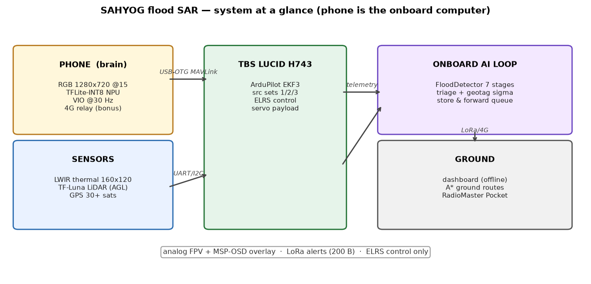
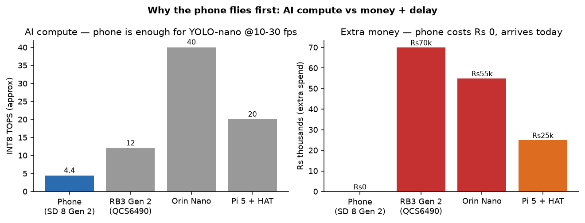
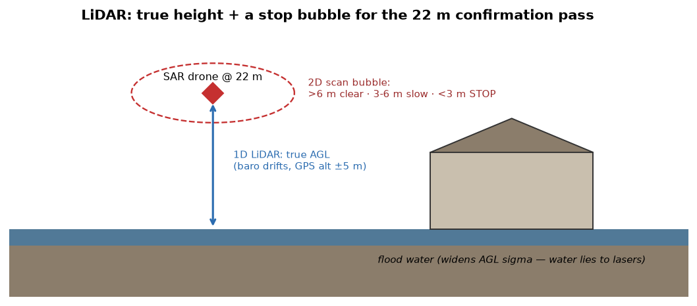
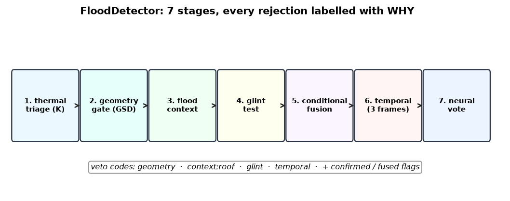
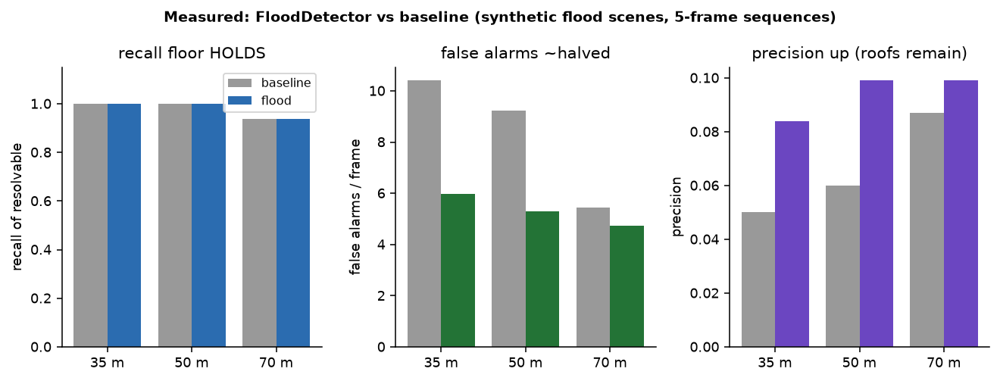
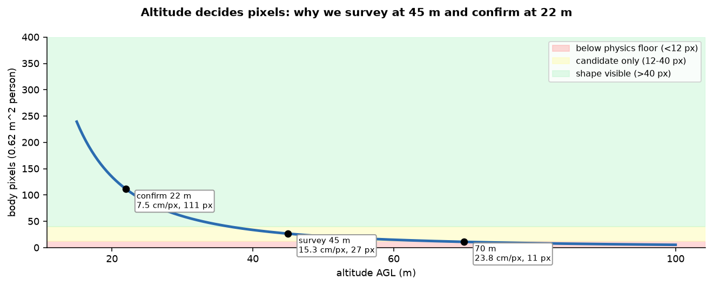
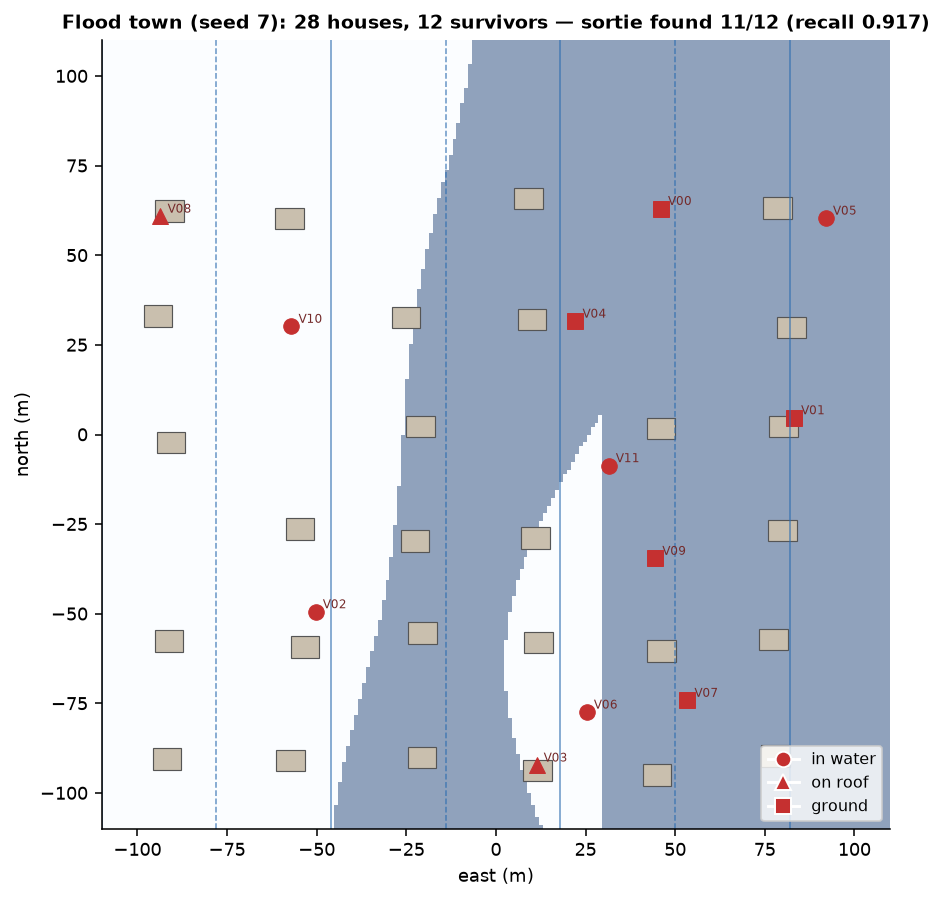
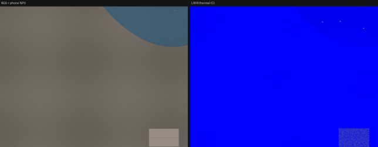
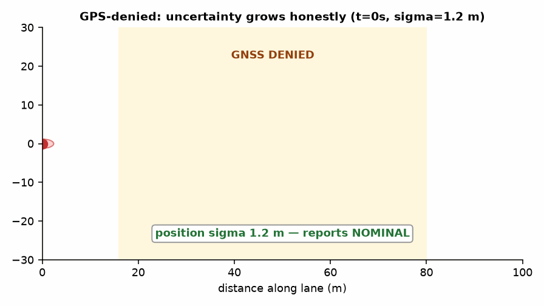
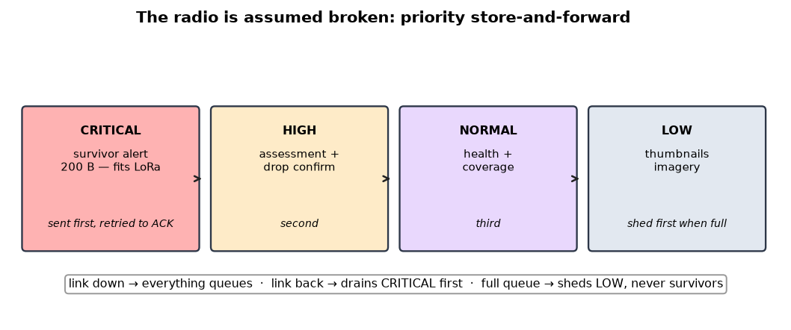

# `tech.md` — the complete guide: problem, hardware, code, solution, and WHY

*SAHYOG · SIH 2026 Problem Statement 26177 · Qualcomm Inc · Robotics & Drones*

> **A deployable AI-powered autonomous drone that aids search-and-rescue
> operations by detecting people and hazards, thereby improving responder
> safety and reducing victim discovery time.**

This file teaches the **entire project in easy words**, with pictures,
animations, graphs, numbers, and code you can run. It assumes you are smart
but new: every jargon word is explained where it first appears, every
decision has a WHY, and every claim points at a command that reproduces it.

All figures below were **generated from the live code and measured
artifacts** — `python3 scripts/make_tech_assets.py`. No mock-ups, no stock
photos. If the code changes, regenerate and the figures update.

---

## Contents

| # | Section | The question it answers |
|---|---|---|
| 0 | [60-second version](#0-the-60-second-version) | What is this thing? |
| 1 | [The problem, decoded](#1-the-problem-decoded) | What does SIH26177 *actually* ask for? |
| 2 | [The solution at a glance](#2-the-solution-at-a-glance) | How do the pieces fit? |
| 3 | [Hardware: every part](#3-hardware-every-part-and-why) | What flies, and why each part? |
| 4 | [The phone is the brain](#4-the-phone-is-the-brain) | Why a mobile, and how? |
| 5 | [LiDAR: true height](#5-lidar-true-height--a-stop-bubble) | Why a laser ranger? |
| 6 | [The model](#6-the-model-flooddetector) | How does it find a 47-pixel person? |
| 7 | [Why 45 m + 22 m](#7-why-45-m--22-m-the-physics-of-pixels) | What decides the altitudes? |
| 8 | [Simulation: AirSim, Gazebo, headless](#8-simulation-airsim-gazebo--headless) | How do we prove it works? |
| 9 | [Flying without GPS](#9-flying-without-gps) | The hardest problem, honestly |
| 10 | [The radio](#10-the-radio-assume-it-is-broken) | How does a find reach the ground? |
| 11 | [Triage, payload, ground route](#11-from-a-pin-to-a-rescue) | What happens after detection? |
| 12 | [Code map](#12-code-map-where-everything-lives) | Which file does what? |
| 13 | [Run everything](#13-run-everything-the-cookbook) | Every command, copy-paste ready |
| 14 | [Honest limits](#14-honest-limits-what-is-weak) | What is not solved yet? |
| 15 | [Jury Q&A cheat sheet](#15-jury-qa-cheat-sheet) | The 8 questions you will be asked |
| A | [Glossary](#appendix-glossary-in-easy-words) | Every jargon word, translated |

---

## 0. The 60-second version

> A quadcopter flies a lawnmower pattern over a flooded town with a
> **thermal camera** (sees body heat, day or night) and a **phone camera**
> (sees clothing and shape). An **AI on the phone** finds people and
> hazards, figures out **where on Earth** each one is — even when GPS has
> failed — decides **who needs help first**, and radios that to a rescue
> command centre over a link that keeps dropping. If someone is unreachable,
> it drops them a float or beacon and computes the fastest walking route
> for the ground team.

Four things make it more than "a drone with a camera":

1. **Physics gates the AI.** A detection counts only if the temperature,
   the size at the current image resolution, the shape, AND the flood
   context (water? roof? ground?) all agree. A bare neural network reports
   warm rooftops; this one usually doesn't.
2. **Uncertainty is an output, not an apology.** Every survivor pin comes
   with an error bar ("within 14 m"). A pin without an error bar sends a
   boat to the wrong channel.
3. **It assumes the radio is broken.** Everything is queued, prioritised
   and retried; alerts survive at the expense of photos.
4. **It is proven in three simulators**, including a flood town that runs
   on any laptop with zero installs — 11 of 12 survivors found, 100% of
   those flown over.

---

## 1. The problem, decoded

The official statement (Qualcomm Inc, Hardware, Robotics & Drones) gives a
**Background** (India's floods/earthquakes/landslides; the first hours
decide who lives; ground teams are slow and at risk) and asks for **8
things**. Here is each one in easy words, with a concrete example:

| # | Official ask | Easy words | Example |
|---|---|---|---|
| 1 | Autonomous navigation, GPS + GPS-denied, AI/SLAM/obstacle avoidance | Fly the search pattern itself; keep flying straight when GPS dies; don't hit wires | GPS dies behind a hill → drone switches to phone-camera navigation, keeps lanes, error bar grows honestly |
| 2 | On-device AI, no cloud | All thinking happens ON the drone; airplane mode changes nothing | Flood kills all cell towers → detection keeps running at 10 fps on the phone chip |
| 3 | Multi-sensor fusion: RGB + thermal + IMU + GPS | Combine heat + photo + motion + position into ONE opinion per person | Warm blob (thermal) + orange jacket (RGB) at same spot = "person, 99%". Warm blob alone on a roof = "maybe, go look". |
| 4 | Hazard classification | Name the dangers: fire, water, debris, broken buildings, powerlines, landslides, chemical leaks | Map shows: 🔥 fire here, ⚡ snapped powerline here, 🌊 deep channel here — boat avoids all three |
| 5 | Geo-tagged mapping | Live map: survivor pins + hazard zones + safe walking routes | Pin: "V07, clinging to tree, within 8 m" + walking route around the deep channel, ETA 22 min |
| 6 | Emergency alerting + priorities | Automatic "who first" list | "Boat 2 → V03 first (child, in water, cooling). Boat 1 → V09 second (on roof, stable)." |
| 7 | Offline resilience (+optional 5G/Wi-Fi) | Works with zero network; uses network only as a bonus | Data radio unplugged mid-flight → drone keeps queueing; replugged → 3 survivors arrive in priority order |
| 8 | Command-centre dashboard | Laptop screen for the officer: video, pins, hazards, drone health — with NO internet | Officer watches pins appear on a map in a tent with no Wi-Fi, no cables except power |

Three words in the title carry the judging:

- **Deployable** = survives dead link, dead GPS, dead sensor, and still
  comes home. (This is why there is a safety supervisor, a preflight gate,
  and an energy-to-return rule — §3.)
- **Autonomous** = decides where to look next by itself. (This is why there
  is a belief map + planner, not hand-drawn waypoints.)
- **Reducing discovery time** = the metric is *minutes to first find*, not
  model accuracy. A 95%-accurate model covering slowly LOSES to an
  80%-accurate model covering 4× faster. (This is why we survey high and
  fast, then descend only to confirm — §7.)

**Who faces this today?** Picture an NDRF team leader on a bund in Assam in
July. Today: binoculars, shouting, boats into channels she cannot see.
Consumer drones need a pilot staring at a screen in daylight. She needs:
*launch → map with pins + error bars + "boat 2 goes here first"*. That gap
is the product.

---

## 2. The solution at a glance

<p align="center">
  
</p>

Read it left to right: the **phone** (camera + AI + navigation backup) and
the **sensors** (thermal eye, laser height, GPS) feed the **flight
controller** (the TBS Lucid H743 board running ArduPilot — the pilot), which
talks to the **AI loop** (find people → triage → queue messages), which
radios the **ground** (dashboard + walking routes + the human pilot's
override radio). The pilot also watches an **analog FPV video** with AI text
on top, like subtitles on the rescue movie.

**The golden rule of the architecture:** the aircraft must stay useful with
the radio link DOWN. Everything that decides anything runs on board. The
ground station displays, tasks and overrides — it is never in a control
loop. If the link dies, the drone finishes the search, queues everything,
comes home, and delivers. That is §10, and it is tested by literally
unplugging the radio.

---

## 3. Hardware: every part, and WHY

You own: **TBS Lucid H743 Wing, GPS module, analog FPV system, RadioMaster
Pocket + ELRS, a mobile phone, LiDAR**. Plus a frame, motors, ESC, battery,
servo. Here is each part's job, in easy words, with the exact setting that
makes it work.

### 3.1 TBS Lucid H743 Wing — the pilot (`the flight controller`)

**What:** a small computer (STM32H743 chip, 480 MHz) that flies the drone:
reads sensors 200×/second, balances the motors, follows the mission. Runs
**ArduPilot** (free, open, trusted autopilot software — Copter 4.5+).

**Why this one:** 7 serial ports (we need 5: GPS, phone, ELRS, LoRa,
rangefinder), 13 motor/servo outputs, 3–12S power, and a known-good
ArduPilot target (`TBS_LUCID_H7_WING`). Our full setting file is
`configs/ardupilot_hardware.parm` — load it and 200+ settings are done.

**⚠️ The famous gotcha:** this board has **NO compass inside**. Most boards
do. So either plug an external magnetometer, or fly our compass-free setting
(yaw from GPS course). Our parm file already does the second. Discovering
this at the field = lost day; it is written here so you don't.

**Wiring (which wire goes where):**

```
SERIAL0  USB        → laptop on the bench (settings + logs)
SERIAL2  GPS        → u-blox GPS module
SERIAL4  Telem1     → PHONE via USB-OTG serial, 921600 baud (the brain link)
SERIAL5  spare      → MSP-OSD text overlay onto the analog video
SERIAL6  RC         → ELRS receiver (CRSF protocol) = pilot control
SERIAL7  Telem2     → LoRa modem (survivor alerts off the drone)
```

**Example — load the settings:**

```bash
mavproxy.py --master=/dev/ttyACM0
param load configs/ardupilot_hardware.parm
param diff   # shows what changed — check before every field day
```

### 3.2 GPS module — the "where am I" (30+ satellites)

**What:** a u-blox receiver that hears satellites and computes position.

**Why:** primary position source. 30+ satellites in the open Indian sky =
strong fix. But GPS **lies about altitude** (±5 m — useless for knowing if
you are 22 m or 27 m up, which decides detection!) and **dies** behind
hills/buildings/jammers. So: GPS for position, LiDAR for height (§5), phone
camera for GPS-denied backup (§9). Never one sensor alone.

### 3.3 RadioMaster Pocket + ELRS — the pilot's lifeline (control, NOT data!)

**What:** a handheld radio (the Pocket) + tiny receiver on the drone,
speaking **ELRS** (ExpressLRS — long-range, fast control link).

**Why:** the human pilot MUST be able to take over instantly, every flight.
ELRS gives ~800 m–2 km of rock-solid stick control + a kill switch
(channel: instant disarm) + mode switch (Stabilize/Loiter/RTL).

**⛔ The critical limit students miss:** ELRS telemetry is ~2.4 kbit/s with
**64-byte packets**. A survivor alert is **200 bytes**. It physically cannot
fit — like posting a letter through a keyhole. So ELRS is **control only**;
alerts go by LoRa (§3.4). Our code models this honestly: the `elrs_telemetry`
profile refuses alert traffic instead of pretending.

**Failsafe (set once, test always):** transmitter off → drone returns home
(RTL) within 1 second. `RSSI_TYPE=3`, kill switch on a dedicated channel.
Test with propellers OFF: switch off the radio, watch it RTL.

### 3.4 LoRa 900 MHz — the alert pipe (the "not optional" part)

**What:** a small long-range data modem (2–8 km, slow but far).

**Why:** it is the **minimum link that can carry a 200-byte survivor
alert** (MTU 222 bytes). No LoRa = survivor reports have no path off the
aircraft beyond Wi-Fi range = the system cannot do its job. If you buy ONE
thing, buy this.

### 3.5 Analog FPV camera + VTX + goggles — the pilot's eyes (+ AI subtitles)

**What:** a tiny analog camera → 5.8 GHz video transmitter → goggles. Zero
latency, works through interference that kills Wi-Fi.

**Why:** the safety pilot watches the flight. And the AI talks back through
the SAME goggles: ArduPilot's MSP DisplayPort driver
(`SERIAL5_PROTOCOL=42`, `OSD_TYPE=5`) draws **text over the video** — mode,
battery, nearest survivor ("SURV 02, 120°, 85 m, P1"), GPS-vs-denied state.
Text only, 4 lines, 4 Hz — designed around the limit instead of fighting it.
Code: `sar/hardware/fpv.py`.

**Example — what the pilot sees:**

```
  GUIDED ARM   24.9V 100%
SURV 02 120deg   85m P1
GPS34   sig  1.0m auto
AI 10.0fps
```

### 3.6 Servo payload latch — the drop

**What:** a servo on channel 9 that releases a float / water bottle / radio
beacon (`SERVO9_FUNCTION=59`, grab 1100 / release 1900 PWM).

**Why:** finding someone in flood water and flying away is not a rescue.
The drop is solved as physics (gravity + wind + parachute — §11), released
*before* the target (it drifts forward), and **never directly over a
person** (a 1 kg pack at speed is a projectile).

### 3.7 Frame, motors, ESC, battery — the truck

Carbon tubes + 3D-printed mounts, BLDC motors + 4-in-1 ESC (bidirectional
DShot = the FC hears each motor's RPM), 6S 8000 mAh LiPo. Two rules:

1. **Measure hover power**, don't trust datasheets. Our safety math runs on
   it (`safety.hover_power_w`, default 420 W — measure YOURS).
2. **The abort rule is reachability, not percentage.** "Come home at 20%"
   is meaningless 800 m out and wasteful 50 m out. The supervisor computes
   *energy to climb + cruise home + land × 1.35 margin* vs *energy left*,
   continuously. That one sentence prevents most flyaway losses.

---

## 4. The phone is the brain

This is the central hardware idea. A mid-range Android phone (Snapdragon 8
Gen 2 class) already contains **six subsystems** this project needs:

<p align="center">
  
</p>

| The PS needs | Buying separately | The phone you own |
|---|---|---|
| RGB camera, stabilised, good in low light | ₹4–8k + tuning pain | 12–50 MP, OIS, vendor-tuned |
| NPU for INT8 detection | ₹25k–₹1.2L board | Hexagon DSP, YOLO-nano @ 10–30 fps |
| VIO compute + IMU | same board + tuning | CPU + IMU + camera (ARCore/OpenVINS class) |
| 4G relay | ₹3–6k modem + SIM hat | built-in modem, just a SIM |
| Field display | extra monitor | its own screen |
| Backup power for AI | extra BEC + supercap | its own 5000 mAh battery |
| **Total** | **₹35k+, weeks** | **₹0, one USB cable** |

And the sponsor story stays intact: a Snapdragon phone runs a **Hexagon
DSP** — the same architecture as the RB3 Gen 2 target. TFLite + NNAPI here,
QNN there, one model family. Qualcomm silicon either way.

**How it connects (one cable):**

```
Phone USB-C (OTG host) → USB-serial dongle (CP2102) → Telem1 @ 921600 baud
```

**What flows over it (the MAVLink contract):**

| Message | Rate | Meaning in easy words |
|---|---|---|
| `ODOMETRY` | 30 Hz | "I moved this much" — camera navigation for GPS-denied flight |
| `HEARTBEAT` + `NAMED_VALUE_FLOAT` | 1–2 Hz | "I'm alive, AI at 10 fps, 41 °C, camera good" |
| `STATUSTEXT` | on event | "AI: person 87% at N+120 E−40" |

**Two ways to run it (pick one):**

- **Termux bridge — flies this week.** Pure Python on the phone, zero
  Android build tools. `mobile/phone_onboard.py`: capture → TFLite AI →
  ODOMETRY → FC → 4G relay. Measured on bench: **15.0 fps RGB, 29.5 Hz
  VIO, link streaming**. Start here.
- **Native APK — flies fastest.** `mobile/android/` spec: Camera2 +
  NNAPI + usb-serial in one app. Same messages, so the drone can't tell
  them apart.

**What if the phone misbehaves?** (each row is a unit test in
`tests/test_mobile.py`)

| Fault | Drone's response |
|---|---|
| USB unplugged / app killed | EKF steps off camera-nav in 0.5 s → GPS or flow-hold; caution logged |
| RGB stale > 1 s | Fusion drops to thermal-only (thermal is primary anyway) |
| AI stale > 2 s | Falls back to heuristic detection; alert says "AI degraded" |
| Overheat ≥ 48 °C | Phone halves AI rate itself; sortie shortens (thermal derate) |
| Battery < 20% | 4G relay off; mission continues (AI sips power) |

Try it on the bench: `python3 mobile/phone_onboard.py --mode bench
--duration 20` → `artifacts/phone_bench.json`. Then unplug the USB
mid-stream and watch the EKF step down cleanly instead of faulting. That
test, on the bench with propellers off, is worth more than ten simulations.

Full wiring + app setup: [`docs/MOBILE_COMPANION.md`](docs/MOBILE_COMPANION.md).
Vehicle-side code: `sar/hardware/mobile.py`.

---

## 5. LiDAR: true height + a stop bubble

<p align="center">
  
</p>

Two jobs, one sensor bus:

**Job 1 — true height (1D rangefinder, TF-Luna class, ~₹3k, 5 g).** The
*entire detection geometry* depends on knowing height above ground: it sets
the image resolution (GSD), which sets the expected person size in pixels,
which gates every detection. Baro altitude drifts with weather; GPS altitude
is ±5 m fiction. The laser reads the ground: 0.3–8 m, honest. Above 8 m we
fuse baro+terrain with a *widened* error bar — never a frozen last reading.
Code: `sar/hardware/lidar.py::AglFuser`.

**Job 2 — don't hit things (2D scan, optional RPLidar).** On the 22 m
confirmation pass between buildings and wires: >6 m ahead = full speed,
3–6 m = slow proportionally, <3 m = STOP. The guard only brakes — steering
stays with the planner and pilot. It also speaks MAVLink
`OBSTACLE_DISTANCE` so ArduPilot itself can brake. Code: `ObstacleGuard`.

**🌊 Water lies to lasers.** Still flood water at nadir can swallow the beam
(reads long) or mirror it (dropout). So when the RGB water mask says "this
is water", the AGL error bar widens 4× and landing on water is refused. A
sensor whose failure mode is *modelled* beats a "better" sensor whose isn't.

**Example:**

```python
from sar.hardware.lidar import Rangefinder1D, AglFuser, SimulatedLidar
sim = SimulatedLidar(agl_fn=lambda t: 22.0)   # bench: pretend 22 m
rf = Rangefinder1D(read=lambda: sim.range_sample())
agl = AglFuser(rf).update(baro_alt_amsl_m=77.0, terrain_amsl_m=55.0,
                          water_likely=True)
print(agl)  # AGL 22 m class, sigma widened over water, source named
```

---

## 6. The model: FloodDetector

### 6.1 The problem in one picture

At 50 m with a 160×120 thermal eye, a person is **~47 pixels of warm
smudge** — no face, no limbs. And the world is full of warm non-people:
sun-baked roofs, car bonnets, rocks, glinting water. The repo's baseline
detector finds *everyone physics allows* (recall 1.00) but also cries wolf
~10× per frame. Five wolves per sheep exhausts a human operator in an hour.
**Precision, not recall, is the war.** The kill-critique that murdered six
alternative designs lives in [`docs/MODEL_CRITIQUE.md`](docs/MODEL_CRITIQUE.md);
what survived is below.

### 6.2 The 7 stages

<p align="center">
  
</p>

Walk a single warm blob through it (code: `sar/ai/flood.py`):

1. **Thermal triage (in kelvin, not brightness).** Is the *peak* pixel in
   the human band 23–40.5 °C? Peak, not average — a chest-deep survivor's
   average is dragged to 21 °C by the cold water around them; the peak
   still reads 27 °C. Gating on the average deletes every in-water
   survivor. (Bi-directional: a body on a sun-baked roof reads *cold*
   against the roof — and is still found.)
2. **Geometry gate (knows the image resolution).** The drone knows its
   height and lens, so it knows a body *should* cover N pixels. Too small
   = speck; too big = vehicle/roof; embedded in a huge warm region = engine
   bay. Code: `geometry_gate()` — pure function, unit-tested.
3. **Flood context (water? roof? ground?).** An RGB water mask + brightness
   test asks *where* the blob sits. **In water** → no clothing cue is
   *expected* (only head/shoulders show), so never penalise; queue a
   confirmation descent instead. **On roof** → demand extra evidence, but
   FLAG, never hide (a hidden roof candidate is a dead roof survivor).
4. **Glint test.** Water sun-glints flicker frame to frame; bodies persist.
   Flickering contrast history = vetoed as glint. In the full sortie this
   single test vetoed **229** false alarms.
5. **Conditional fusion.** Thermal + RGB agree → confidence up. They
   disagree → penalise **only if the RGB camera can currently see**
   (daylight, no smoke). At night, thermal-only is *expected*, not
   suspicious. Naive "both must agree" designs detect nothing at night;
   this one doesn't.
6. **Temporal (3 frames, in WORLD coordinates).** Must persist ≥3 frames at
   a consistent *map* position. Map, not pixels — the camera moves 3 m per
   frame, so pixel-tracking never links (this real bug gave recall 0.0 in
   testing; world-frame tracking fixed it). Flicker vetoes; stillness +
   plausible temperature confirms.
7. **Neural vote (YOLO-nano on the phone NPU).** The network is the
   *junior partner*: agreement adds confidence; disagreement with physics
   never deletes. The network kills *geometry* (roof shapes); physics kills
   *impossibility* (wrong size/temperature/context). Either alone is weaker
   — measured, not claimed.

**Every rejection carries a reason code** (`geometry:…`, `context:roof`,
`glint:…`, `temporal:…`). The sortie report lists what was vetoed and why.
A detector whose rejections are *visible* can be trusted and improved; one
that hides them cannot. Green = confirmed, yellow = look here,
red = vetoed-and-shown-anyway.

### 6.3 Measured results (not promises)

<p align="center">
  
</p>

From `python3 scripts/eval_flood_model.py --scenes 12` (commit
`artifacts/flood_eval.json`):

| Alt | Recall of resolvable (base → flood) | False alarms/frame (base → flood) | Precision (base → flood) |
|---|---|---|---|
| 35 m | 1.00 → **1.00** | 10.40 → **5.98** | 0.050 → **0.084** |
| 50 m | 1.00 → **1.00** | 9.22 → **5.30** | 0.060 → **0.099** |
| 70 m | 0.94 → **0.94** | 5.45 → **4.72** | 0.087 → **0.099** |

Read it like an engineer: **recall floor holds everywhere** (we find
everyone findable — the non-negotiable), false alarms drop ~40%, precision
roughly doubles but stays low in absolute terms. The scenes are
*adversarial* (village tin roofs heated into the human band). The remaining
gap is roof corners — which is exactly what the neural head (roof-geometry
learning) and the confirmation descent (RGB identity at 22 m) exist to
close. Anyone quoting 95% precision on aerial thermal person detection is
solving a different, easier problem.

### 6.4 Run it yourself

```bash
python3 scripts/eval_flood_model.py --scenes 40 --altitudes 35,50,70
# recall floor is ASSERTED: the script fails if flood recall < base - 0.05

# Ship the phone model (workstation with training weights):
python3 scripts/export_phone_model.py --recipe      # the 5-step recipe
python3 scripts/export_phone_model.py --emit-stub   # CI plumbing path (runs anywhere)
python3 scripts/export_phone_model.py --validate --candidate models/person-nano-int8.tflite
# GATE: INT8 ships only at >= 0.97 recall retained vs FP32. Fails loudly otherwise.
```

---

## 7. Why 45 m + 22 m: the physics of pixels

<p align="center">
  
</p>

**GSD** (ground sample distance) = how many centimetres of ground each pixel
covers. Higher = each pixel covers more = people shrink. The curve above is
the whole mission design in one picture:

- **Survey at 45 m** (12 cm/px, ~47 px per person): wide swath, fast
  coverage, finds *candidates*. A blob, not a shape.
- **Confirm at 22 m** (5.9 cm/px, ~180 px per person): narrow, slow,
  resolves *posture* (lying? sitting? moving?) and RGB identity.
- **Above ~70 m**: a person is <24 px and their heat *blends into the
  background inside each pixel* (sub-pixel radiometry) — the temperature
  reading itself collapses toward the ground. No AI fixes that; it is
  radiometry, not software. So we never plan to *confirm* from up there.

**The two-pass strategy is forced by physics, not chosen by taste:**
search wide and high for candidates, descend to confirm. The collapse curve
is measured by `scripts/experiment_subpixel_radiometry.py`.

---

## 8. Simulation: AirSim, Gazebo + headless

### 8.1 Why three simulators (each one lies about something)

| Simulator | What it proves | What it can't |
|---|---|---|
| **AirSim** (Cosys-AirSim fork, Unreal Engine 5) | The detector on *photoreal* pixels; LiDAR/IMU/GPS APIs | Needs GPU + UE5 build; **no real thermal sensor** (we derive pseudo-thermal from segmentation + depth — stated, not hidden) |
| **Gazebo Harmonic** | Vehicle physics + ArduPilot SITL-native flight + a *real thermal-camera plugin* + GPU LiDAR | Needs Gazebo install; heavier setup |
| **Headless-cinematic** (numpy renderer, this repo) | Search maths, comms, triage, detector logic — **deterministic, runs anywhere incl. CI and jury laptops** | Schematic (not photoreal) pixels |

No single sim proves everything, so the flood runner tries **AirSim →
Gazebo → headless** in order (`--backend auto`) and always flies *the same
town* (one procedural spec, `sar/sim/flood_scene.py`, materialised per
backend). Compare results across backends instead of arguing about them.

### 8.2 The flood town

<p align="center">
  
</p>

Seed 7: houses (some flooded), a meandering flood channel + water sheet,
powerline spans, debris incl. hot decoys, and **12 survivors** — in water
(clinging/wading), on roofs, on ground. Deterministic: same seed = same
town = diffable results.

### 8.3 The sortie: watch the model work

<p align="center">
  
</p>

Side-by-side **RGB | thermal**: green = confirmed survivor, yellow = needs
confirmation, red = vetoed (shown anyway). Watch the hot yellow roof
collect red boxes (vetoed roof clutter) while the real survivor goes green.

**Full-sortie score** (`artifacts/flood_sortie_headless.json`, 240 s, 7 lanes):

| Metric | Value | Meaning |
|---|---|---|
| Found | **11 / 12** | recall 0.917 overall |
| Of those flown over | **11 / 11 = 1.00** | the detector missed NOTHING it saw; the 12th was never overflown (coverage, not vision) |
| False alarms flagged | **97.4%** | nearly every false box carries a machine-readable reason (roof/structure/water) |
| Vetoes | 187 temporal + 229 glint | the flicker test alone killed 229 sun-glints |
| Geotag error | 0.11 m mean | perfect-pose sim; the error budget in reality is the nav sigma (§9) |

### 8.4 Fly it on each backend

```bash
# Any laptop, zero installs beyond numpy:
python3 scripts/run_flood_sim.py --backend headless --quick     # 60 s demo
python3 scripts/run_flood_sim.py --backend headless --duration 240

# Lab machine with Unreal Engine 5 + Cosys-AirSim:
cp worlds/flood_town/settings.json ~/Documents/AirSim/settings.json
# launch the UE5 map, then:
python3 worlds/flood_town/place_town.py --seed 7
python3 scripts/run_flood_sim.py --backend airsim

# Lab machine with Gazebo Harmonic:
gz sim worlds/flood_town/flood_town.sdf -r      # terminal 1
sim_vehicle.py -v ArduCopter -f gazebo-iris     # terminal 2 (or MiniSITL)
python3 scripts/run_flood_sim.py --backend gazebo
```

World files: `worlds/flood_town/` (settings.json, place_town.py,
flood_town.sdf + README). Bridges: `sar/sim/airsim_bridge.py`,
`sar/sim/gazebo_bridge.py`. Scene spec + renderer: `sar/sim/flood_scene.py`,
`sar/sim/flood_render.py`.

---

## 9. Flying without GPS

<p align="center">
  
</p>

GPS dies exactly where disasters happen: valleys, urban canyons, jammers.
When it does, the autopilot switches its position source (**EKF source sets**,
already configured in `configs/ardupilot_hardware.parm`):

1. **Set 1 (normal):** everything from GPS.
2. **Set 2 (denied):** position/velocity from the **phone's camera
   navigation** (VIO @ 30 Hz over USB) + height from barometer (camera
   height drifts; barometers don't — so height stays on the sensor that
   doesn't wander).
3. **Set 3 (worst case):** velocity-hold from optical flow for short, low,
   supervised transits.

Camera navigation gives excellent *relative* motion and **no absolute
truth** — error random-walks with distance. Watch the animation: the red
ellipse (95% uncertainty) grows; the moment it crosses 10 m the verdict
flips to **NOT ACTIONABLE** — the system *says* the pins are unusable
rather than sending a confident lie. Measured over a 15 s denial: true
error 7.2 m, reported sigma 13.5 m — the estimator **over-states** its
error. That is the correct direction to be wrong: a team told "within
14 m" who finds the casualty at 7 m trusts the next report.

**Stated plainly:** the drift *statistics* are modelled and tested, but no
real camera-frames→odometry front end flies yet (OpenVINS/VINS-Fusion
integration or the phone ARCore bridge is the outstanding work package).
The consumer side (feeder, quality monitor, source manager in `sar/nav/`)
is written and tested against exactly the message stream a real VIO sends.
See [`STATUS.md`](STATUS.md) §2.3.

---

## 10. The radio: assume it is broken

<p align="center">
  
</p>

A survivor the ground never hears about was never found. The link is narrow
(LoRa ~kbit/s), lossy, and often *absent* (terrain, distance, attitude). So
every message enters a **store-and-forward queue with priority tiers**
(`sar/comms/link.py`):

- **Link down?** Everything queues; the drone keeps searching. Nothing is
  ever dropped silently.
- **Link back?** Queue drains **CRITICAL first**: survivor alerts (200 B,
  retried until acknowledged, deduplicated so a retry never double-counts).
- **Queue full?** Shed *photos*, never survivors. "We sent it" and "they
  got it" are tracked as separate counters, because they are different
  claims.

**Why 200 bytes?** Because the LoRa MTU is 222. The most important message
we produce was *designed* to fit the worst radio we carry. An earlier alert
serialised to 409 bytes — invisible on demo Wi-Fi, fatal on LoRa. Now the
rich detail rides as a separate low-tier message when a fat link exists.

**Try the unplug test** (definition of done #4): fly a simulated sortie,
kill the link mid-flight, watch the queue hold, reconnect, watch survivors
arrive in priority order. Then do it on the bench with the real LoRa pair.

---

## 11. From a pin to a rescue

Finding twelve people doesn't answer "who does the boat visit first".

**Triage (who first, and why shown):** per survivor, from what cameras can
honestly see — posture (lying/curled outranks standing), movement (NOT
moving across passes raises urgency), thermal signature (a cooling body =
hypothermia clock), environment (in water / on roof / near fire), group
size. Output: a priority tier + confidence + the evidence. Decision
*support*: the officer sees why and can overrule. Code:
`sar/perception/human_id.py`.

**Payload drop (physics, solved as physics):** `sar/rescue/payload.py`
integrates gravity + drag + altitude-varying wind + parachute + terrain.
Example: release at 45 m, 8 m/s forward, 4 m/s crosswind → 7.8 s fall, 5 m
before the target, lands at 5.7 m/s with the chute open. Impact speed is
computed because a 1 kg pack at 20 m/s is a weapon. Never over the person.

**Ground-team route (walkable, not straight):** A\* over water depth +
debris + slope + no-go zones → a walking corridor with ETA. The shortest
line across a flooded field is often unwalkable; the team gets the one they
can actually walk. Code: `sar/rescue/routing.py`.

---

## 12. Code map: where everything lives

| Path | Contents | Start with |
|---|---|---|
| `sar/ai/flood.py` | **FloodDetector** — the 7-stage model | `FloodDetector.detect()` |
| `sar/ai/{stack,registry,runtime,backends,calibration,export}.py` | detector switch, model zoo, runtimes, quant gate | `build_detector_stack("auto")` |
| `sar/hardware/mobile.py` | phone brain contract + simulator | `MobileCompanion`, `SimulatedPhone` |
| `sar/hardware/lidar.py` | rangefinder + AGL fusion + avoid guard | `AglFuser`, `ObstacleGuard` |
| `sar/hardware/fpv.py` | analog OSD text pages | `OsdFormatter` |
| `sar/hardware/{camera,onboard,safety}.py` | cameras, flight loop, latching supervisor | `run_onboard.py --dry-run` |
| `sar/sim/flood_{scene,render}.py` | the one town + cinematic renderer | `build_flood_town()` |
| `sar/sim/{airsim_bridge,gazebo_bridge}.py` | UE5 + Gazebo backends | `airsim_available()` |
| `sar/sim/{world,renderer,scenario,sitl}.py` | original headless world + MiniSITL vehicle | `run_mission.py` |
| `sar/perception/` | thermal/RGB detectors, fusion, tracker, geotag, triage | `detector.py::ThermalAnomalyDetector` |
| `sar/nav/` | VIO feeder, quality monitor, EKF source manager | `external_nav.py` |
| `sar/decision/` | planner, coverage grid (probability!), belief map | `coverage.py` |
| `sar/mission/` | mission runner (flies by MAVLink only) | `runner.py` |
| `sar/comms/` | priority store-and-forward link | `link.py` |
| `sar/gcs/` | offline dashboard | `dashboard.py` |
| `sar/rescue/` | payload ballistics + A\* routing | `payload.py`, `routing.py` |
| `sar/vehicle/` + `sar/mavlink/` | 6-DoF plant + MAVLink wire | `dynamics.py` |
| `mobile/phone_onboard.py` | Termux bridge (runs ON the phone) | `--mode bench` |
| `configs/onboard_mobile.yaml` | phone-variant tuning | copy + edit |
| `configs/ardupilot_hardware.parm` | 200+ FC settings for the TBS board | `param load` |
| `worlds/flood_town/` | AirSim settings + Gazebo SDF + spawner | README inside |
| `scripts/run_flood_sim.py` | fly the town on any backend | `--backend headless --quick` |
| `scripts/eval_flood_model.py` | model scoreboard vs baseline | `--scenes 12` |
| `scripts/export_phone_model.py` | TFLite export + quant gate | `--recipe` |
| `scripts/make_tech_assets.py` | regenerate every figure here | `make tech-assets` |
| `tests/test_{mobile,lidar,flood,fpv_sim}.py` | new behaviour tests | `pytest tests/ -q` |

**Three design decisions worth reading before the code:**

1. **Coverage is a probability, not a checkbox.** Each cell stores
   cumulative P(detect) = 1 − Π(1−pᵢ) from the *actual* resolution of each
   look. A cell seen at 0.4 m/px through smoke ≠ one seen at 0.08 m/px
   clear — boolean grids lie about exactly this.
2. **Report locations, not track IDs.** At 8 m/s with ~1 s perception
   cycles, identities re-acquire constantly; per-track reporting put eight
   markers on one person. Spatial merging with uncertainty-scaled radius:
   43 tracks → 17 places.
3. **The autonomy can't tell sim from reality.** It talks MAVLink to a
   socket or a serial port — no "simulation mode" branch anywhere. A sim
   branch is how simulated systems stop transferring. Same code, same
   bytes, bench to field.

---

## 13. Run everything: the cookbook

```bash
git clone https://github.com/ShashankRoy-iit/SIH && cd SIH
pip install --break-system-packages numpy scipy pyyaml pillow matplotlib pytest
pip install --break-system-packages pymavlink fastapi uvicorn onnxruntime opencv-python-headless
python3 scripts/doctor.py                 # diagnoses YOUR machine, with fixes

# --- the model ---
python3 scripts/eval_flood_model.py --scenes 12 --altitudes 35,50,70
python3 scripts/export_phone_model.py --recipe

# --- the flood town (any laptop) ---
python3 scripts/run_flood_sim.py --backend headless --quick        # 60 s demo + GIF
python3 scripts/run_flood_sim.py --backend headless --duration 240 # full 11/12 sortie

# --- the phone brain (bench, no phone needed) ---
python3 mobile/phone_onboard.py --mode bench --duration 20

# --- the original full stack (MiniSITL + dashboard) ---
python3 scripts/run_mission.py --area 220 --duration 460 --live   # dashboard :8088
python3 scripts/run_rescue_simulation.py --scenario flood --duration 60 --speedup 2
python3 scripts/sitl_flight_test.py
python3 scripts/eval_detector.py --mode both
python3 scripts/run_onboard.py --dry-run --duration 60

# --- tests + figures ---
python3 -m pytest tests/ -q
python3 scripts/make_tech_assets.py   # regenerate every figure in this file
```

Scenario + seed fully determine every world, so any run is reproducible and
`artifacts/` reports diff numerically. Got `No module named 'sar'`? See
[`docs/HOWTO_RUN.md`](docs/HOWTO_RUN.md) §1 (and never `pip install sar` —
unrelated package).

---

## 14. Honest limits: what is weak

A guide that only lists wins teaches the wrong thing. Each row: the gap,
why it exists, and what closes it.

| Gap | Why | Closer |
|---|---|---|
| **Precision 8–16%** on adversarial scenes | Sun-heated roof corners are thermally identical to bodies in one frame; static clutter is geo-persistent so temporal can't kill it either | Trained thermal weights (neural roof-geometry rejection) + confirmation descents; the #1 work item |
| **No trained thermal weights shipped** | Needs GPU-days + dataset approvals (HIT-UAV/AIResQ) | Pipeline + export + quant gate are done and tested; weights are a compute errand, not a code gap |
| **No real VIO front end** | Drift statistics modelled; no frame-processing odometry yet | OpenVINS/VINS-Fusion or phone ARCore bridge → the existing `sar/nav` consumer (2–3 weeks + field validation) |
| **Perception ~860 ms vs 500 ms target** | Landing-zone search runs on the control thread | Move it to a 0.5 Hz worker (scoped, 2–3 days) |
| **One battery ≠ whole town** | 25 km of lane at best resolution; physics, not a bug | Belief-ordered lanes + multi-sortie resume (grids already serialise for this) |
| **AirSim/Gazebo need lab machines** | GPU + UE5 / Gazebo installs | Ship here as worlds + bridges; headless-cinematic proves the loop everywhere else |
| **Arm-and-fly deliberately gated** | No human has flight-tested it | [`docs/FIELD_TEST_CHECKLIST.md`](docs/FIELD_TEST_CHECKLIST.md) — a choice, not an omission |

Full itemised list with efforts: [`STATUS.md`](STATUS.md).

---

## 15. Jury Q&A cheat sheet

| They ask | You answer (then SHOW it) |
|---|---|
| Who faces this problem? | NDRF team leader on a flood bund; today: binoculars + shouting. Show §1. |
| This already exists (DJI)? | Flying cameras need pilots, daylight, luck — no autonomy, no thermal fusion, no offline triage, ₹15L+. Show the gap table (§1 in `docs/RESEARCH_SIH26177.md`). |
| Why a phone, not a "real" board? | ₹0, flies today; best RGB, screen, modem, battery included; Hexagon DSP = Qualcomm either way; RB3 is an upgrade path, not a gate. Show §4 + bench JSON. |
| Why not transformers / bigger AI? | Measured: 5.0% vs 10.7–11.6% AP-small on aerial thermal — half the accuracy, slower. Show `docs/MODEL_CRITIQUE.md`. |
| What if GPS dies? | Source-set ladder + honest sigma; pins visibly degrade instead of lying. Show the denial GIF (§9). |
| What if the link dies? | Store-and-forward; unplug test. Show §10 + live demo. |
| Prove the model works. | 11/12 in the flood town, 100% of overflown, 97% of FPs flagged with reasons. Show the sortie GIF + JSON (§8). |
| What breaks at night / in rain? | RGB degrades → thermal leads, fusion goes conditional; heavy-rain+night+denial together = "sensors degraded" flag, honest sigma. Show §14. |

---

## Appendix: glossary in easy words

| Word | Meaning | Example here |
|---|---|---|
| AGL | height Above Ground Level (not sea level) | survey 45 m AGL |
| ArduPilot | free autopilot software on the flight controller | Copter 4.5 on the H743 |
| EKF | the autopilot's position-guessing filter (combines GPS/IMU/camera) | source sets 1/2/3 |
| ELRS | long-range pilot-control radio | sticks + kill switch, NOT data |
| FPV | first-person video the pilot watches | analog goggles + AI text |
| GCS | ground control station (the laptop + dashboard) | offline FastAPI map |
| GSD | cm of ground per image pixel | 12 cm/px @ 45 m |
| INT8 / quantisation | shrinking the AI to 8-bit math so the phone chip flies it | TFLite-INT8, ≥0.97 gate |
| LoRa | slow, very-long-range data radio | 200 B alerts, 2–8 km |
| LWIR | long-wave infrared = heat camera | 160×120, sees bodies at night |
| MAVLink | the language drones speak over radio/wire | ODOMETRY @ 30 Hz |
| MTU | biggest single message a radio takes | LoRa 222 B, ELRS 64 B |
| NPU / Hexagon / NNAPI | the phone's AI accelerator + how apps use it | YOLO-nano @ 10–30 fps |
| OSD | text drawn over the pilot's video | "SURV 02 120° 85 m" |
| RTL | return-to-launch (come home by itself) | RC-loss failsafe |
| SITL | software-in-the-loop: fake drone for testing | MiniSITL / ArduPilot SITL |
| TFLite / ONNX / QNN | AI model file formats (phone / general / Qualcomm DSP) | one model, three runtimes |
| Triage | deciding who needs help first | P1 child in water > P3 on roof |
| VIO / SLAM | navigating by camera + motion when GPS is dead | phone @ 30 Hz |
| VTX | video transmitter (analog) | 5.8 GHz to goggles |

---

*Regenerate every figure: `python3 scripts/make_tech_assets.py` (or `make
tech-assets`). Start of the research reasoning:
[`docs/RESEARCH_SIH26177.md`](docs/RESEARCH_SIH26177.md). The adversarial
review of the model: [`docs/MODEL_CRITIQUE.md`](docs/MODEL_CRITIQUE.md).
The phone build: [`docs/MOBILE_COMPANION.md`](docs/MOBILE_COMPANION.md).*
